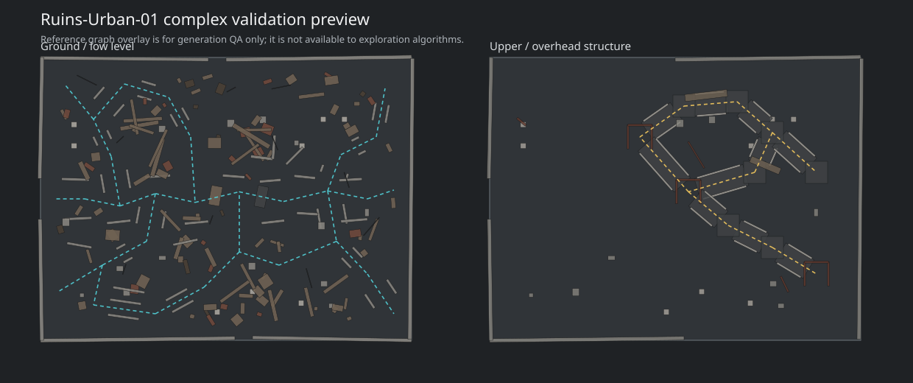

# Ruins-Urban-01

Ruins-Urban-01 is a reproducible, parameterized 3D urban-ruins environment for autonomous UAV exploration research.
It targets Ubuntu 20.04, ROS Noetic, Gazebo Classic, PX4/Prometheus, FUEL, RACER, and MARSIM workflows.

The repository itself is a ROS package. Clone it directly into `~/catkin_ws/src/ruins_urban_01`.



## Research Scope

The benchmark supports research on:

- single- and multi-UAV autonomous exploration;
- online 3D occupancy mapping;
- frontier and dynamic-topological-graph extraction;
- cooperative task allocation and reallocation;
- fixed-map comparison and unseen-map generalization;
- geometry, communication, and perception stress tests.

The environment is never pre-partitioned for the UAVs. Names in the generator and validation graph are for modeling and
clearance checks only. Exploration algorithms must discover free space and frontiers online.

## Scene Specification

| Item | Value |
|---|---|
| Scene extent | 42 m x 32 m x 8 m |
| UAV collision diameter | `D = 0.65 m` |
| Normal corridor | 2.70 m |
| Narrow corridor | 1.45 m |
| Squeeze passage | 1.22 m, complex profile only |
| Vertical connector | 2.20 m |
| Fixed profiles | `base`, `medium`, `complex` |
| Default visual fog | disabled |

The scene contains normal and narrow corridors, occluded forks, loops, dead ends, collapsed wall slabs, rubble fields,
columns, low-overhead sections, forced altitude changes, a partial second level, and up to three vertical connectors.

| Profile | Seed | Boxes | PCD points | Branches | Loops | Dead ends | Vertical connectors |
|---|---:|---:|---:|---:|---:|---:|---:|
| base | 240701 | 93 | 101753 | 6 | 2 | 3 | 0 |
| medium | 240702 | 133 | 146476 | 12 | 5 | 5 | 2 |
| complex | 240703 | 175 | 201374 | 14 | 6 | 6 | 3 |

## Repository Layout

```text
.
├── config/                  scene parameters, geometry and benchmark seeds
├── docs/                    design, generation and reproducibility notes
├── experiments/             batch-run protocol and result schema
├── gazebo/models/           Gazebo Classic models
├── gazebo/worlds/           fixed and generated worlds
├── launch/                  Gazebo, FUEL, RACER and MARSIM examples
├── maps/pcd/                point-cloud maps
├── meshes/dae/              Collada meshes
├── meshes/obj/              Wavefront meshes
├── scripts/                 deterministic and randomized generators
├── validation/              clearance reports and previews
├── CMakeLists.txt
├── package.xml
└── setup_env.sh
```

## Quick Start on Ubuntu 20.04

```bash
cd ~/catkin_ws/src
git clone https://github.com/hu5426y/ruins-urban-01.git ruins_urban_01

cd ~/catkin_ws
catkin_make
source devel/setup.bash
source src/ruins_urban_01/setup_env.sh

roslaunch ruins_urban_01 gazebo_ruins_urban_01.launch variant:=complex
```

If an old copy named `ruins_urban_01_old` still contains `package.xml`, move it outside `~/catkin_ws/src`; otherwise
`catkin_make` will report duplicate package names.

## Fixed Benchmarks

Use fixed worlds for fair comparisons:

```bash
roslaunch ruins_urban_01 gazebo_ruins_urban_01.launch variant:=base
roslaunch ruins_urban_01 gazebo_ruins_urban_01.launch variant:=medium
roslaunch ruins_urban_01 gazebo_ruins_urban_01.launch variant:=complex
```

Recommended exploration bounds:

```text
box_min_x = -21.0
box_max_x =  21.0
box_min_y = -16.0
box_max_y =  16.0
box_min_z =   0.0
box_max_z =   8.0
```

Recommended three-UAV entrance poses:

```text
UAV1: x=-19.0, y=-0.8, z=1.2
UAV2: x=-19.0, y= 0.0, z=1.6
UAV3: x=-19.0, y= 0.8, z=2.0
```

## Randomized Instances

Generate a new validated complex instance:

```bash
cd ~/catkin_ws/src/ruins_urban_01
python3 scripts/generate_random_ruins.py --profile complex
```

The command prints the generated seed and launch command. Reproduce an exact instance:

```bash
python3 scripts/generate_random_ruins.py \
  --profile complex \
  --seed 20260724 \
  --clutter-scale 1.20
```

Additional controls:

```text
--rubble N
--columns N
--collapsed-walls N
--pcd-step METERS
--fog
```

Do not use `--fog` in the main geometry comparison. Treat it as a separate perception-degradation experiment.
Every generated world writes a manifest to `validation/generated/`.

## Regenerate the Fixed Package

The deterministic generator rebuilds the three fixed variants and all derived files:

```bash
python3 scripts/generate_ruins_package.py
```

Use Blender only when an editable `.blend` source or a Blender-native export is required:

```bash
blender --background --python scripts/generate_ruins_urban_01_blender.py -- --variant complex
```

## FUEL, RACER and MARSIM

The PCD maps under `maps/pcd/` are the primary integration format.

- FUEL examples: `launch/fuel_map_pub_ruins_urban_01_*.launch`
- RACER snippet: `launch/racer_ruins_urban_01_snippet.launch`
- MARSIM template: `launch/marsim_ruins_urban_01_template.launch`
- Shared bounds: `config/fuel_racer_ruins_urban_01.yaml`
- MARSIM settings: `config/marsim_ruins_urban_01.yaml`

These files are examples because upstream package names and topic interfaces may differ between forks. Keep upstream
FUEL/RACER/MARSIM code in separate repositories and change only map paths, bounds, sensor topics, and vehicle namespaces.

## Validation

Run repository checks:

```bash
python3 scripts/verify_repository.py
```

The generator performs a reference-centerline clearance check to catch accidentally sealed passages. The reference graph
is never exposed to the exploration algorithm.

| Profile | Validation | Minimum centerline clearance |
|---|---:|---:|
| base | passed | 0.412 m |
| medium | passed | 0.412 m |
| complex | passed | 0.394 m |

## Experimental Protocol

- Tune on `base`, `medium`, and a declared development-seed set.
- Freeze all algorithm parameters before unseen-seed testing.
- Run every method with identical worlds, start poses, sensor parameters, bounds, and stopping criteria.
- Record the seed, git commit, method configuration, coverage-time curve, paths, collisions, task assignments, and runtime.
- Report mean and dispersion over repeated trials; do not regenerate a favorable map after seeing a result.

See [docs/reproducibility.md](docs/reproducibility.md) and [experiments/README.md](experiments/README.md).

## Citation

Until the associated paper is published, cite the software using [CITATION.cff](CITATION.cff). A versioned release and
Zenodo DOI should be created for the manuscript's final experimental commit.

## License

MIT License. Third-party simulators and planning systems retain their own licenses.
